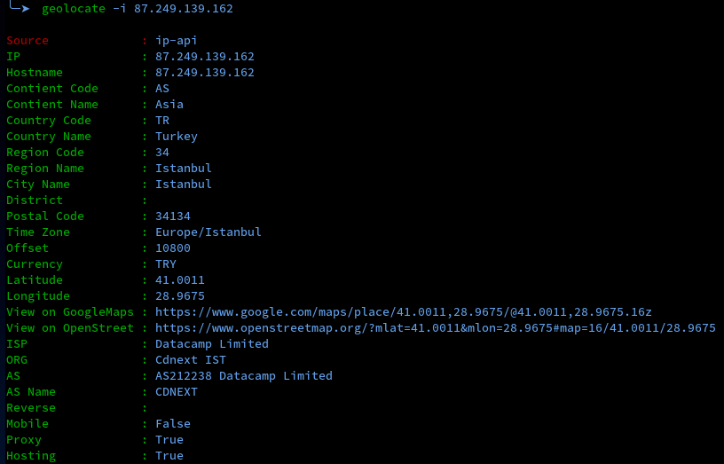
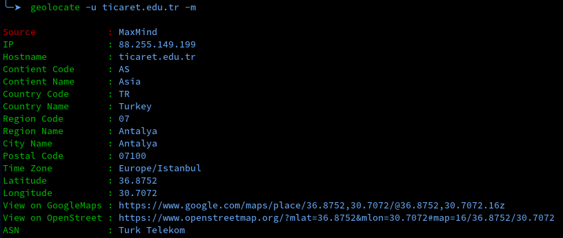

# Geolocate
It queries geographical information using IP or hostname information. Online or offline query sources can be used.

### Installation
```
git clone https://github.com/skyw4ll/geolocate.git
cd geolocate/
chmod +x install.sh
./install.sh
```


> [!NOTE]
> The default query source is ip-api.


### Usage
```
usage: geolocate [-h] [-i IP] [-u URL] [-m]

options:
  -h, --help         show this help message and exit
  -i IP, --ip IP     ip address
  -u URL, --url URL  url or hostname
  -m, --maxmind      use the maxmind
```


> [!IMPORTANT]
> In order to use the maxmind database, api-key must be obtained from the maxmind website and the ***geoipupdate*** tool must be installed.

> [!NOTE]
> If you just want to use the ip-api query source, you can use it without installing maxmind.

### MaxMind Help

For Debian
`sudo apt install geoipupdate`

After:
You will need to replace the `YOUR_LICENSE_KEY_HERE` placeholder with an active license key associated with your MaxMind account.

maxminddb path `/var/lib/GeoIP/*.mmdb`

> More Information
> https://dev.maxmind.com/geoip/updating-databases

### Screenshots
ip-api



Maxmind



